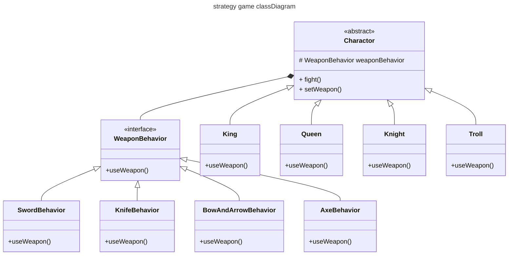

```mermaid
---
title: strategy game classDiagram
---
classDiagram
    class WeaponBehavior{
        <<interface>>
        +useWeapon()
    }
    class SwordBehavior{
        +useWeapon()
    }
    class KnifeBehavior{
        +useWeapon()
    }
    class BowAndArrowBehavior{
        +useWeapon()
    }
    class AxeBehavior{
        +useWeapon()
    }
    WeaponBehavior <|--SwordBehavior
    WeaponBehavior <|--KnifeBehavior
    WeaponBehavior <|--BowAndArrowBehavior
    WeaponBehavior <|--AxeBehavior
    Charactor *--  WeaponBehavior
    class Charactor{
        <<abstract>>
        # WeaponBehavior weaponBehavior 
        + fight()
        + setWeapon()
    }
    class King{
        +useWeapon()
    }
    class Queen{
        +useWeapon()
    }
    class Knight{
        +useWeapon()
    }
    class Troll{
        +useWeapon()
    }
    Charactor <|-- King
    Charactor <|-- Queen
    Charactor <|-- Knight
    Charactor <|-- Troll

```
