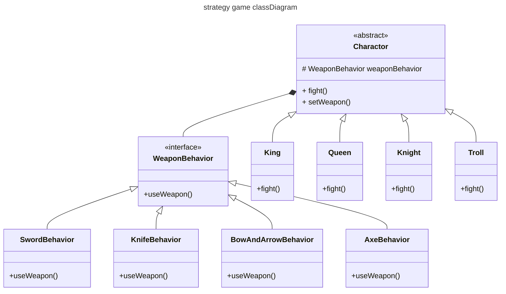

# 《设计模式》实验指导书

- 姓名：
- 学号：

## 策略模式实验（2学时）

- [x] ==我承诺：本次实验完全为本人独立完成！==

### 实验目的

- 理解策略模式基本概念
- 掌握策略模式的使用

### 实验工具

- 计算机，安装JDK
- vscode或eclipse

### 实验题目

- 基于策略模式，设计一个简易的文字版动作冒险类游戏。

### 实验步骤

1. 设计一个动作冒险类游戏，其中有游戏角色类和角色可以使用武器的类，其中角色在游戏中一次只能使用一种武器，但是可以在游戏中切换武器。
2. 武器接口`WeaponBehavior`：
   - 抽象方法`useWeapon()`
   - 四个子类：`SwordBehavior`, `KnifeBehavior`, `BowAndArrowBehavior`, `AxeBehavior`
3. 角色抽象类Character：
   - 具体角色包括`King`,`Queen`,`Knight`,`Troll`
   - 每个角色有不同的`fight()`方法，`fight`方法中首先介绍自己是谁（如输出“I'm a King!”），并调用目前武器的`useWeapon()`方法
   - 角色可通过`setWeapon()`方法设置武器，且应在构造时通过此法初始化武器
4. 程序的主函数可参考下述代码：
   ```java
       public static void main(String[] args) {
            Character character = new King();
            character.fight();
            character = new Queen();
            character.fight();
            character = new Knight();
            character.fight();
            character = new Troll();
            character.fight();
            character.setWeapon(new AxeBehavior());
            character.fight();
        }
   ```

### 实验内容

#### 关键类的源程序清单：

```java
// APp.java
public class App {
    public static void main(String[] args) throws Exception {
        Character character = new King();
        character.fight();
        character = new Queen();
        character.fight();
        character = new Knight();
        character.fight();
        character = new Troll();
        character.fight();
        character.setWeapon(new AxeBehavior());
        character.fight();
    }
}
```

```java
//Character.java
public abstract class Character {
    protected WeaponBehavior weaponBehavior;
    public void setWeapon(WeaponBehavior weaponBehavior){
        this.weaponBehavior=weaponBehavior;
    };
    public abstract void fight();
}
```

```java
//WeaponBehavior.java
public interface WeaponBehavior {
    public void useWeapon();
}
```
```java
//Knight.java
public class Knight extends Character {
    public Knight() {
        this.weaponBehavior = new SwordBehavior();
    }

    public void fight() {
        System.out.println("I'm a Knight!");
        weaponBehavior.useWeapon();
    }
}
```

```java
// SwordBehavior
public class SwordBehavior implements WeaponBehavior {
    @Override
    public void useWeapon() {
        System.out.println("winter is coming,show your sword!");
    }
}

```
#### 相关类的类图：

### 实验总结

- 此处可列出心得体会、遇到的问题、尝试的解决方案、其他意见或建议等。
  - 心得体会
    - 组合 优于 继承
    - 

### 教师评语

